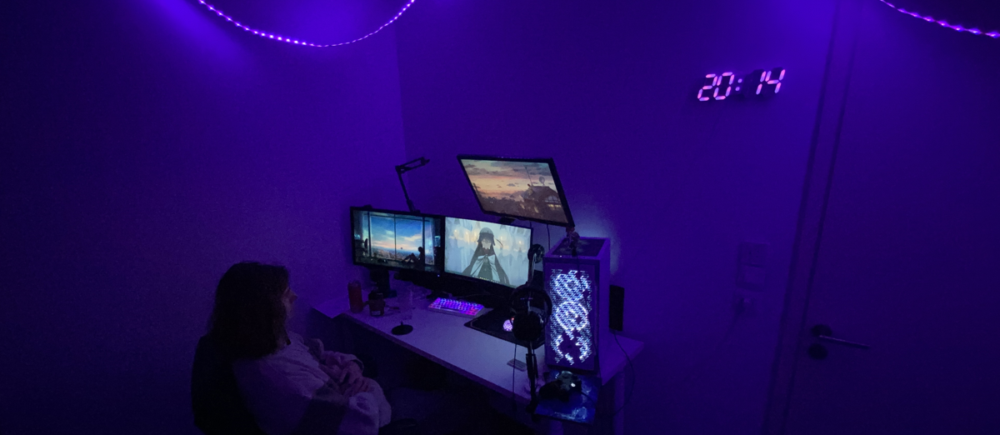

<h3 align="center"> Hi there, I'm Antoine Veber, you can call me SstealzZ   I'm a french student in computer science </h3>

- 🔭 I'm currently studying at Epitech
- 🌱 I'm interested in DevOps, Cybersecurity and Web Development
- 📫 How to reach me:

<!-- Important Projects/Repos -->

<h3 align="center"> Important Projects/Repos </h3>

    <!-- &emsp;&emsp;&nbsp;&nbsp; for adding space -->

<!-- Github Stats -->

<h3 align="center"> Github Stats </h3>
<!--
            &nbsp; -> space
            &emsp; -> 4x(&nbsp;)
-->

    

     &emsp;&emsp;
    

### Skills ( Languages & Tools & Hardware ):

## contact me

